# 4KHoop Marketplace — Architecture & Flow

**Status:** Draft v2 · **Date:** 2026-09-05
**Scope:** A free Laravel marketplace that aggregates products (ecommerce) and services (booking) from 10+ existing tenants — each keeping its own storefront and its own customers — with a path to onboard external websites later.

---

## 1. The Core Idea

Today each tenant runs as its own storefront on the multi-tenant Laravel platform:

| Tenant | Type | Primary domain |
|---|---|---|
| Vantastic Barber | Booking (services, staff, time slots) | `vantasticbarber.com.au` |
| Melbourne Building Products | Ecommerce (physical products, stock) | `melbournebuildingproducts.com.au` |
| …8+ others | Mixed | various |

The Marketplace is a **separate Laravel application** that sits in front of all of them. It never becomes the source of truth for a tenant's catalog, price, stock or calendar. It holds a **read-optimised projection** of every tenant, and it **delegates the transaction** (checkout / booking confirmation) back to the tenant that owns the inventory.

> **One sentence:** the Marketplace owns *discovery*; the tenant owns *truth*.

### Commercial model — free

The marketplace is **free for everyone**: no listing fee, no subscription, no commission on any sale or booking, and no charge to the customer. A tenant keeps 100% of the ticket price; a customer pays what they would have paid on the tenant's own site.

Two consequences run through the rest of this document:

- **Price parity is a rule, not a preference.** With no commission to absorb, a tenant has no reason to price differently here. Listings show the tenant's own price, unchanged, and a price mismatch is a sync bug rather than a business decision.
- **Nothing in the architecture may assume revenue.** Commission ledgers, payout splits and tenant invoicing are out of scope. `commission_rate` stays in the schema as a reserved column fixed at `0.00`, so a paid tier later is a data change rather than a redesign.

One thing "free" does not cover, because it cannot: payment processing fees, if the marketplace collects the money. See §9.

---

## 2. System Landscape

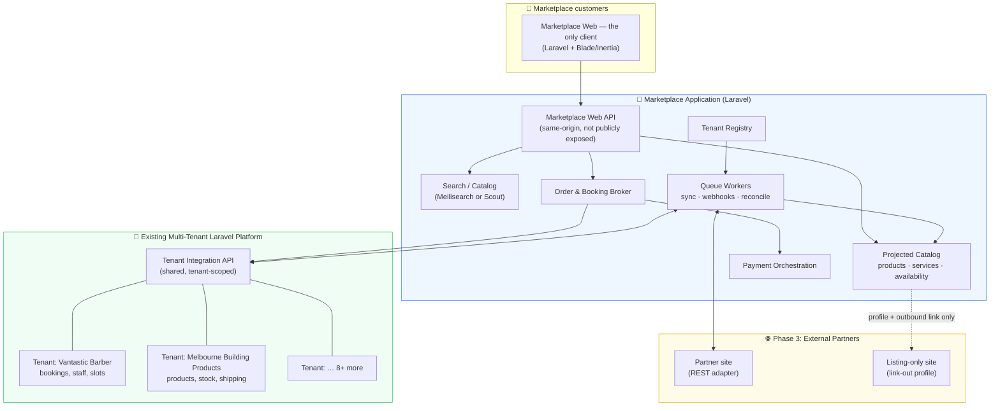

---

## 3. Customers & Accounts

Tenants keep their storefronts and keep their own customers. The marketplace does not absorb either — it adds a **second, separate customer population**: people who found the tenant through the marketplace and who book or buy without ever visiting the tenant's site.

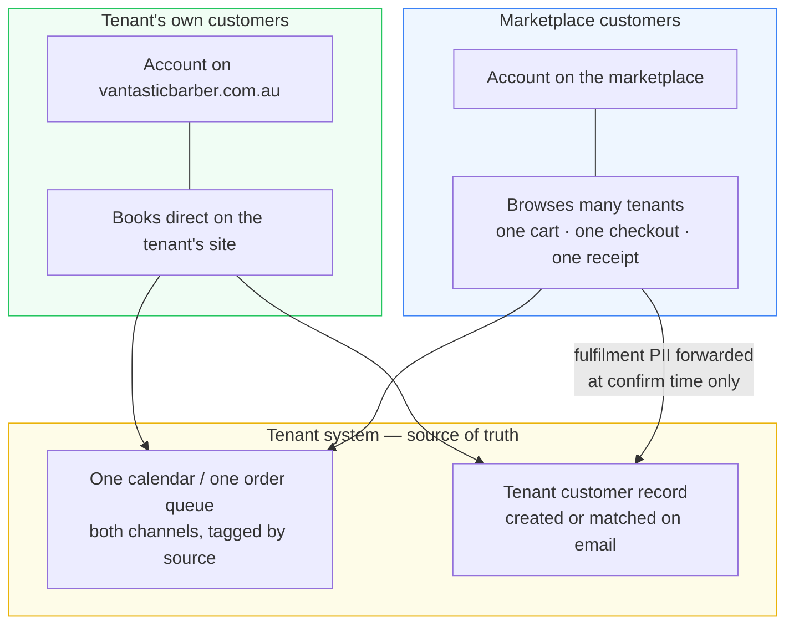

**Rules**

1. **No shared login.** A marketplace account and a tenant-site account are separate credentials, even for the same person. SSO is explicitly out of scope; revisit only if customers actually ask for it.
2. **One calendar, one queue.** A tenant sees marketplace and direct bookings in the same dashboard, tagged by source channel. Availability is computed across both — which is exactly why the tenant, never the marketplace, is the authority on whether a slot is free (§7).
3. **PII is forwarded, not shared.** At confirm/order time the marketplace sends only what fulfilment requires: name, contact, delivery address, order lines. The tenant never receives the marketplace account, its credentials, or the customer's activity across other tenants.
4. **Both sides are independent controllers of that data.** The marketplace privacy policy must say plainly that booking or buying passes your details to the merchant, after which the merchant's own terms govern. This is a launch blocker, not a nicety.
5. **Identity matching is the tenant's job.** If the same human exists on both sides, the tenant dedupes on email/phone inside its own system. The marketplace never attempts to reconcile identities across tenants.
6. **Attribution is retained.** Every forwarded transaction carries `source: marketplace`, so a tenant can measure what the channel is worth to them. In a free model this is the only "invoice" a tenant ever sees.

---

## 4. Integration Tiers

Not every tenant will integrate to the same depth. Design for three tiers from day one so Phase 3 is not a rewrite.

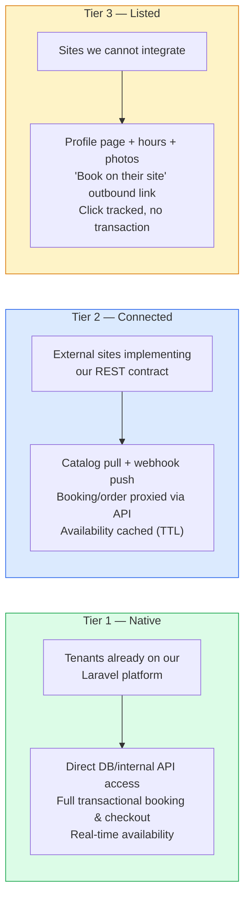

| | Tier 1 Native | Tier 2 Connected | Tier 3 Listed |
|---|---|---|---|
| Catalog | Push on change + nightly full sync | Pull on schedule + webhooks | Manual / CSV / scraped-with-consent |
| Availability | Live query at slot-selection time | Cached, revalidated at checkout | N/A |
| Transaction | Booked/ordered inside marketplace | Proxied to partner API | Outbound link |
| Payment | Marketplace or tenant (see §9) | Usually partner-side | Partner-side |
| Cost to tenant | Free | Free | Free |
| Effort to onboard | Config only | Partner dev work | Content entry |

**Vantastic Barber and Melbourne Building Products are both Tier 1.** They validate the two hardest paths (booking + physical goods) before any external partner is invited.

---

## 5. Where Data Lives

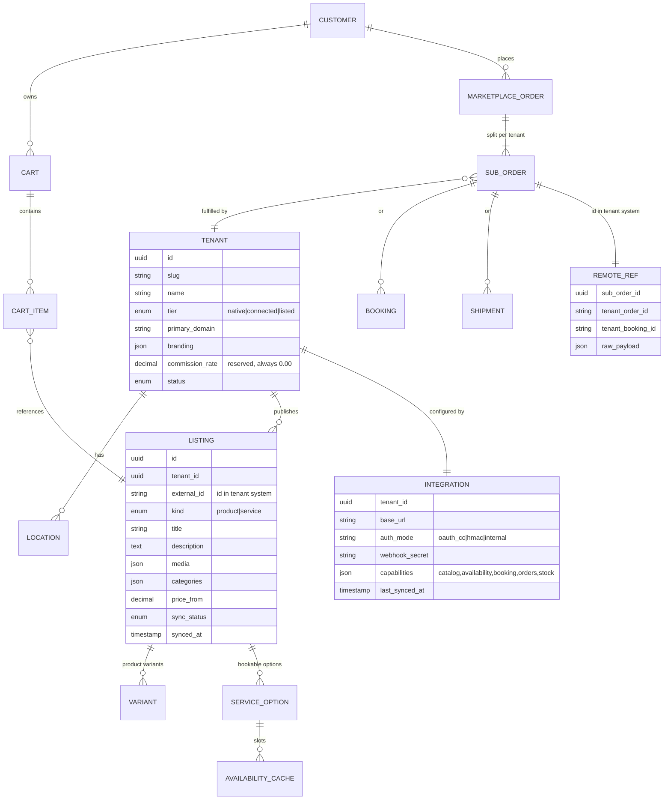

**Key rules**

1. `LISTING.external_id` + `tenant_id` is the natural key. Never let marketplace IDs leak into tenant systems as authority.
2. Money is stored in **minor units (integer cents)**, never floats.
3. `AVAILABILITY_CACHE` is disposable. If it's empty or stale, the UI degrades to a live query, not to an error.
4. Every write to a tenant carries an **idempotency key** derived from `sub_order.id`.
5. `CUSTOMER` here is a **marketplace** customer only. The tenants' own customer tables are not projected, not synced and not joined to this one (§3). The only crossing point is the fulfilment payload on a confirmed sub-order.

---

## 6. Catalog Sync Flow

Two directions, both needed. Push keeps things fresh; pull is the safety net that repairs drift.

```mermaid
sequenceDiagram
    autonumber
    participant T as Tenant App
    participant Q as Marketplace Queue
    participant W as Sync Worker
    participant DB as Projected Catalog
    participant S as Search Index

    rect rgb(240, 253, 244)
    Note over T,S: A. Event-driven push (near real-time)
    T->>T: Product/Service saved (model observer)
    T->>Q: POST /webhooks/catalog {tenant, event, payload, sig}
    Q-->>T: 202 Accepted (verify HMAC, enqueue)
    Q->>W: ProcessCatalogEvent job
    W->>DB: Upsert listing by (tenant_id, external_id)
    W->>S: Index / reindex document
    end

    rect rgb(239, 246, 255)
    Note over T,S: B. Scheduled reconciliation (nightly, per tenant)
    W->>T: GET /api/v1/catalog?updated_since=…&cursor=…
    T-->>W: 200 {items[], next_cursor}
    loop paginated
        W->>DB: Upsert batch
    end
    W->>DB: Soft-delete listings absent from full snapshot
    W->>S: Bulk reindex
    W->>DB: integrations.last_synced_at = now()
    end

    rect rgb(254, 252, 232)
    Note over W: C. Failure handling
    W->>W: Retry w/ exponential backoff (3 attempts)
    W->>DB: On exhaustion → mark tenant sync_status=degraded
    W->>W: Alert ops; listings stay visible but flagged stale
    end
```

**Why both:** webhooks are lossy (deploys, downtime, dropped queues). The nightly full pull is what stops a customer seeing a product that was deleted three weeks ago.

---

## 7. Booking Flow (Vantastic Barber pattern)

The critical constraint: **the marketplace must never be the authority on whether a slot is free.** It shows candidates; the tenant confirms.

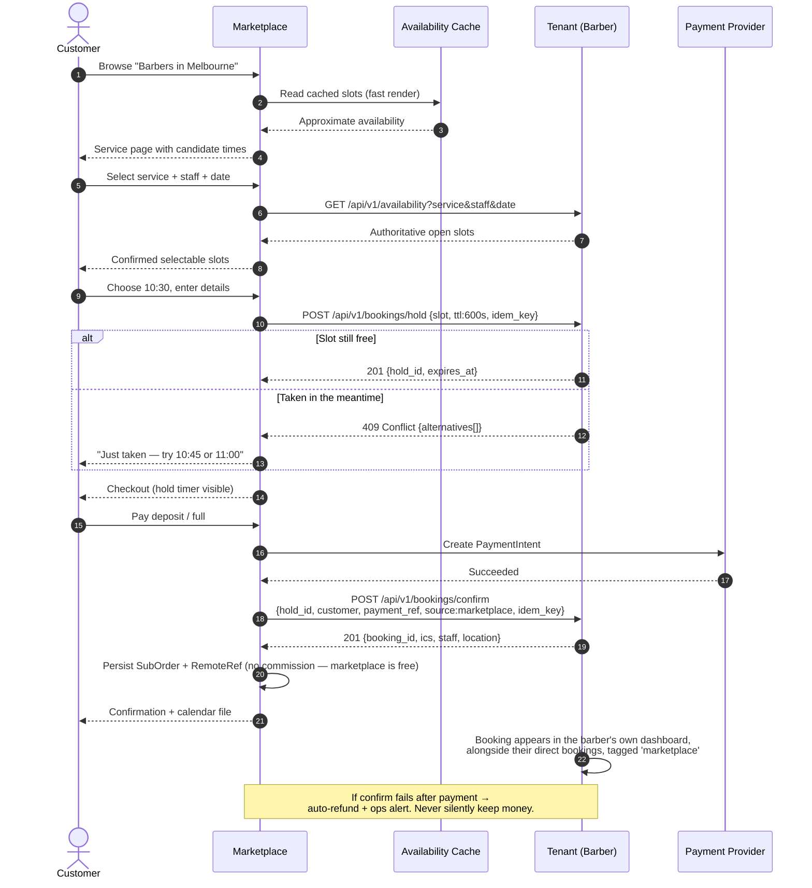

### Hold expiry / failure states

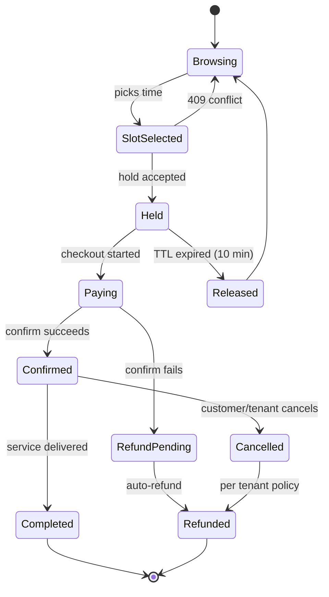

---

## 8. Ecommerce Order Flow (Melbourne Building Products pattern)

A single cart can contain items from multiple tenants. The marketplace splits it.

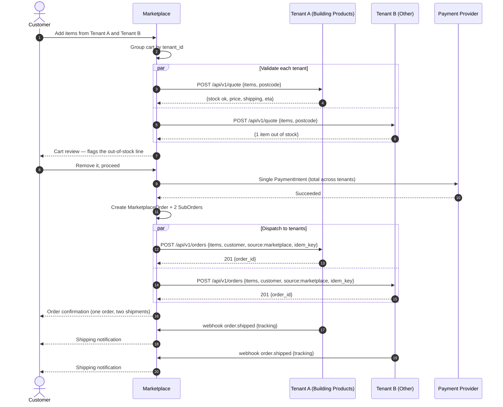

> **Partial-failure rule:** if Tenant B's order POST fails after payment, do **not** roll back Tenant A. Mark that sub-order `failed`, refund only its portion, notify the customer. A retry queue attempts the dispatch for 24h before refunding.

---

## 9. Payments — Two Models

This is the decision that most shapes the build, and the free model (§1) changes its arithmetic. With no commission to collect, the case *for* routing money through the marketplace is purely **checkout experience**; the case *against* is real liability — chargebacks, refund disputes, merchant-of-record questions — carried for no revenue.

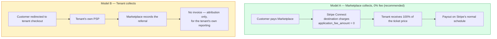

**Recommend Model A for Tier 1, with a 0% application fee.** It is still the only model that supports a genuine multi-tenant cart — one payment, one receipt, several merchants — which is the whole point of letting our customers buy *in* the marketplace rather than being bounced out to ten different checkouts. Model B stays the fallback for Tier 2/3 partners who will not give up their checkout, and remains available to any Tier 1 tenant who prefers their own PSP.

### The one cost "free" cannot absorb

Stripe still charges roughly **1.75% + A$0.30** on a domestic card payment. That fee exists whoever collects. Someone has to carry it:

| Who bears it | Mechanism | Effect |
|---|---|---|
| **Tenant** *(leaning)* | Stripe deducts it from the connected account's payout | The tenant nets what they would have netted on their own site, where they pay the same fee. The marketplace itself still takes nothing. |
| Marketplace | Fees charged to the platform account | Genuinely zero-cost for the tenant, but an open-ended expense that grows precisely with success. Model it before promising it. |
| Customer | Surcharge at checkout | Breaks price parity and depresses conversion. Not recommended. |

This is the one place a promise of "free" can be misheard, so put it in writing to the pilot tenants before building payouts: *free means we take no commission; card processing fees are still Stripe's, and they come out of your payout exactly as they do today.*

Other consequences of Model A to plan for: each tenant needs a Stripe Connect account (KYC/onboarding flow), refunds must reverse the transfer, and GST handling belongs to the tenant as merchant of record — get accounting advice before launch.

---

## 10. The Integration API Contract

One versioned contract, implemented natively by the platform and by external partners as an adapter. This is what makes Phase 3 cheap.

```mermaid
graph LR
    subgraph Contract["Tenant Integration API v1"]
        direction TB
        C1["GET /catalog<br/>paginated, updated_since"]
        C2["GET /catalog/{id}"]
        C3["GET /availability<br/>service, staff, date range"]
        C4["POST /bookings/hold"]
        C5["POST /bookings/confirm"]
        C6["DELETE /bookings/{id}"]
        C7["POST /quote<br/>stock + shipping"]
        C8["POST /orders"]
        C9["GET /orders/{id}"]
    end

    subgraph Webhooks["Tenant → Marketplace"]
        W1["catalog.updated / deleted"]
        W2["availability.changed"]
        W3["stock.changed"]
        W4["order.shipped / cancelled"]
        W5["booking.rescheduled / cancelled"]
    end

    subgraph Impl["Implementations"]
        I1["Native driver<br/>(in-platform, internal calls)"]
        I2["HTTP driver<br/>(external partner)"]
        I3["Null driver<br/>(Tier 3, listing only)"]
    end

    Contract --> I1
    Contract --> I2
    Contract --> I3
    Webhooks --> Contract

    style Contract fill:#eef6ff,stroke:#3b82f6
    style Impl fill:#f0fdf4,stroke:#22c55e
```

**In Laravel this is a driver interface**, resolved per tenant from the registry:

```php
interface TenantConnector
{
    public function catalog(?CarbonInterface $since, ?string $cursor): CatalogPage;
    public function availability(AvailabilityQuery $q): SlotCollection;
    public function hold(HoldRequest $r): Hold;
    public function confirm(ConfirmRequest $r): Booking;
    public function quote(QuoteRequest $r): Quote;
    public function placeOrder(OrderRequest $r): RemoteOrder;
    public function capabilities(): Capabilities;
}
```

`NativeConnector`, `HttpConnector`, `NullConnector`. Adding a partner in Phase 3 becomes a config row, not a code branch. Every call goes through a decorator stack: **URL guard → auth → timeout → retry → circuit breaker → cache → response validation → log**. The two security decorators are not optional and not per-tenant configurable — `UrlGuard` (SSRF, §11.9) runs before the request leaves and `ResponseValidator` runs before anything a tenant returned reaches the projection.

### Capability negotiation

A tenant declares what it supports; the UI adapts rather than showing broken buttons.

| Capability | If absent, UI shows |
|---|---|
| `availability` | "Enquire" button instead of a slot picker |
| `booking` | Outbound link to tenant's booking page |
| `stock` | No stock badge; validate at checkout only |
| `orders` | "Buy on their site" link |

---

## 11. API Security

A marketplace is a security problem before it is a product problem: it holds one tenant's data next to a competitor's, moves other people's money, and — from Phase 4 — calls URLs that strangers supply. This section is the controls layer, written to be handed to a client or an auditor as-is.

**The single rule everything else serves:** a credential issued to one tenant must be *structurally* incapable of reaching another tenant's data, and every claim in this section must be provable by a test that runs in CI (§11.11).

### 11.1 Four API surfaces, four trust models

Security is not uniform across the app. Each surface has a different attacker, so each gets a different stack.

| # | Surface | Who calls it | Authentication | Primary threat |
|---|---|---|---|---|
| S1 | **Public marketplace API** — browse, search, cart, checkout | Our own web app only, same-origin | Sanctum session cookie + CSRF; most reads anonymous. **No API tokens are issued to customers at all** | Scraping, BOLA on orders, business-flow abuse (slot squatting) |
| S2 | **Outbound → Tenant Integration API** | Marketplace workers and request handlers | OAuth2 `client_credentials`, per-tenant, scoped, 15-min tokens; mTLS optional | Over-broad tokens, SSRF, hostile responses |
| S3 | **Inbound webhooks ← tenants** | Tenant apps and partner adapters | HMAC-SHA256 over the raw body + timestamp + replay cache | Forgery, replay, cross-tenant injection |
| S4 | **Admin & tenant dashboard API** | Our staff; tenant staff (Phase 3) | Session + mandatory 2FA + role scopes | Privilege escalation, insider access to other tenants |

### 11.2 Trust zones

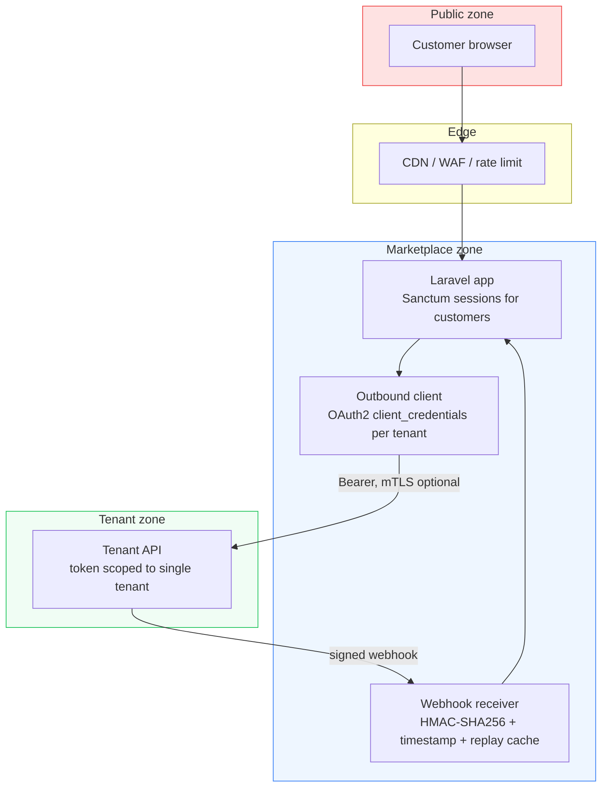

### 11.3 The request pipeline — defence in depth

Every inbound request passes the same ordered stack. A failure at any layer short-circuits to a 4xx **and writes an audit record**; nothing fails open.

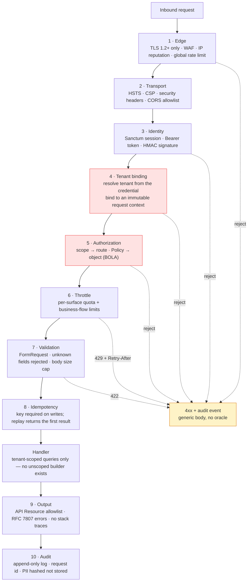

Layers 4 and 5 are highlighted because they are the two that, if wrong, leak one tenant's data to another. Everything else is hygiene; those two are the product's licence to operate.

### 11.4 Authentication

**S1 — customers.** Sanctum, **session-cookie only**. Argon2id password hashing, optional TOTP 2FA, cookies `HttpOnly; Secure; SameSite=Lax`, CSRF token on every cookie-authenticated write. Login, registration and password-reset are throttled per IP *and* per account (§11.7) with a generic response — never reveal whether an email exists.

With a web app as the only client, this surface gets meaningfully smaller, and the design takes advantage of it rather than building for a mobile app that does not exist:

- **No personal access tokens are issued to customers.** There is no long-lived bearer credential to steal, leak into a log, or forget to revoke — the entire class of stolen-token attacks does not apply.
- **The public API is same-origin.** CORS carries our own origin and nothing else; no wildcard, no credentialed cross-origin requests. A third-party site cannot call it from a browser at all.
- **`SameSite=Lax` is real protection here**, not a partial measure it would be if a native client also had to authenticate.

If a mobile app is ever built, this is the section that changes: it needs token auth, which reopens the token-theft, revocation and CORS questions above. Treat that as a security work item at the time, not a small client addition.

**S2 — outbound to tenants.** OAuth2 client credentials, one client per tenant, token cached in Redis until 60s before expiry. Scopes are explicit and least-privilege:

```
tenant:{uuid} catalog:read availability:read bookings:write orders:write
```

A connector that only needs the catalog is issued a token without `bookings:write`. mTLS is offered to any tenant that wants it and is **required** for Tier 2 partners handling payment data.

**S3 — inbound webhooks.** Signature over the raw body, verified *before* JSON decoding:

```
X-4KH-Key-Id:     whsec_vantasticbarber_2026a
X-4KH-Timestamp:  1757049600
X-4KH-Signature:  v1=<hex hmac_sha256(secret, signing_string)>

signing_string = timestamp . "." . method . "." . path . "." . sha256_hex(raw_body)
```

Rules: reject if `|now − timestamp| > 300s`; compare with `hash_equals` (constant time); cache the signature for 600s in Redis and reject any repeat; the `Key-Id` selects the secret so two secrets are valid during rotation. **Unsigned webhooks are rejected in every environment, staging included** — a staging bypass is how these become production bypasses.

> Laravel gotcha: verify against `$request->getContent()`, not a re-encoded array. Re-serialising changes the bytes and breaks the signature — or worse, tempts someone into a lenient comparison.

**S4 — staff and tenant admins.** 2FA mandatory, no shared accounts, role scopes, and — for our own staff — access to a tenant's data is logged and visible to that tenant in their dashboard.

### 11.5 Authorization — the two isolation failures that matter

**Tenant isolation (cross-tenant read).** The credential resolves a tenant at layer 4 and binds it into a request-scoped context. Every model that carries `tenant_id` has a global scope reading that context, and the context object **throws if it is unbound** rather than defaulting to "all tenants". A query that forgets the scope fails loudly in development instead of quietly returning everyone's data.

**Object-level authorization / BOLA (OWASP API1).** Route-level auth is not enough: an authenticated customer must not read another customer's order by changing the id. Every single-object route goes through a Laravel Policy — never a bare `find()`. IDs are UUIDv7, so they are neither guessable nor enumerable, but that is defence in depth, not the control.

The corresponding control on writes is **BFLA (API5)**: a tenant token may write to *its own* sub-orders only. `POST /orders` carrying another tenant's `sub_order_id` is a 403 and a paged alert, because it can only be an attack or a serious bug.

### 11.6 PII minimisation and data handling

- The tenant receives exactly what fulfilment requires — name, contact, delivery address, order lines, `source: marketplace`. Never the marketplace account, password hash, payment instrument, or the customer's activity at other tenants (§3).
- Customer PII is encrypted at rest at the column level (`encrypted` casts) for contact details; the database is encrypted at the volume level as well.
- **Cards never touch our servers.** Stripe Elements collects them; we hold only a PaymentIntent id. This keeps us in **PCI DSS SAQ A** scope — the cheapest and safest posture — and it is worth saying to the client in exactly those words. The `client_secret` is never logged.
- Stripe's own webhooks are verified with Stripe's signature scheme, not ours.
- Data retention: audit logs 90 days hot / 12 months cold; abandoned carts purged at 30 days; account deletion propagates a deletion request to tenants that received the customer's details.

### 11.7 Rate limiting, quotas and business-flow abuse

| Surface / route | Limit | Keyed on |
|---|---|---|
| Browse & search | 120 req/min | IP, plus 600/min per session |
| Login / register / password reset | 5 req/min, exponential lockout | IP **and** account |
| Cart & checkout | 30 req/min | Customer |
| **Booking hold** | 10/min, **max 3 concurrent holds** | Customer + IP |
| Webhook receiver | 600/min, 429 with `Retry-After` | Tenant |
| Outbound to a tenant | Concurrency cap + circuit breaker | Tenant (§12) |

The booking-hold row is the one specific to this business. A 10-minute hold that costs an attacker nothing can be used to **squat every slot in a barber's day** — OWASP API6, unrestricted access to a sensitive business flow. Controls: short TTL, concurrent-hold cap, a verified email or phone before the first hold from a new account, held slots released immediately on payment failure, and a tenant-visible list of active holds with a manual release. Repeated abandoned holds from one identity trip a soft block.

### 11.8 Input and output hygiene

- Every endpoint has a `FormRequest`. Unknown fields are **rejected**, not ignored — silent acceptance is how mass-assignment bugs hide.
- No `$request->all()` into `fill()`; explicit `$fillable`, and `$guarded = ['*']` on anything financial.
- Responses go through API Resources — an explicit allowlist of fields. Eloquent models are never returned directly, which is what prevents a new column from silently becoming public (OWASP API3).
- Request bodies capped (1 MB public, 10 MB webhook), JSON nesting depth capped, uploads type- and size-checked and served from a separate origin.
- Errors are RFC 7807 `application/problem+json`: a stable code, no stack trace, no SQL, no internal hostnames. `APP_DEBUG=false` is asserted by a production health check that fails the deploy if it is true.

### 11.9 Outbound calls are attack surface too

This is the part most designs miss, and it is the one that matters most from Phase 4, when a partner supplies their own `base_url`.

**SSRF (OWASP API7).** A partner-supplied URL is validated at registration *and re-validated at request time*: HTTPS only; the resolved IP must be public — reject `127.0.0.0/8`, `10/8`, `172.16/12`, `192.168/16`, `169.254.0.0/16` (including the cloud metadata endpoint `169.254.169.254`), `::1` and `fc00::/7`; no redirects followed; DNS re-resolved at call time and pinned for the connection so a rebinding attack cannot swap the address between check and use. All egress goes through an allowlist proxy, so a bypass in application code still hits a network-level deny.

**Hostile responses (OWASP API10).** A tenant response is untrusted input:

- Response size capped (2 MB) and decompression bounded — no zip bombs.
- Payload validated against the contract schema before it reaches the projection; a malformed catalog page fails that tenant's sync rather than corrupting the index.
- **Listing descriptions are sanitised to an HTML allowlist on ingest and escaped on render.** A projected catalog means a compromised tenant could otherwise store XSS in our pages — this is the highest-likelihood path to marketplace-wide customer compromise.
- Remote images are re-hosted or restricted to allowlisted hostnames; a `javascript:` or `data:` media URL never reaches a template.
- Timeouts on every call (3s connect/read), because a hanging partner is a denial of service against us.

### 11.10 Secrets, rotation and revocation

- Secrets live in the vault/env; `webhook_secret` and OAuth credentials are stored with Laravel's `encrypted` cast, never plaintext in the registry — a database dump must not be a set of working credentials.
- Every secret carries a **key id**, so rotation is: issue new → both valid → tenant switches → retire old. No downtime, no big-bang.
- Rotation cadence: 90 days routine, immediately on any suspicion, and automatically when a tenant's staff member with access leaves.
- **Break-glass:** one admin action disables a tenant integration — revokes tokens, rejects its webhooks, and marks its listings stale — usable in seconds without a deploy.
- CI secret scanning on every push; a committed secret is treated as compromised and rotated, not deleted from history and forgotten.

### 11.11 Audit, detection and proof

An append-only `api_audit_log` records actor, tenant, route, decision, request id, IP and outcome for every authenticated call and every rejection. Bodies are **not** stored; a hash is, so a dispute can be resolved without the log becoming a second copy of the PII. `X-Request-Id` is generated at the edge and propagated into tenant calls, so one identifier traces a booking across three systems.

Alerts that page a human, rather than filling a dashboard nobody reads:

| Signal | Why it pages |
|---|---|
| Any cross-tenant 403 at layer 4/5 | This should be impossible. One occurrence is either an attack or a broken deploy. |
| Webhook signature failures > 1% for a tenant | Rotation gone wrong, or forgery attempts. |
| Auth failure spike on one account or IP range | Credential stuffing. |
| Refund or payout volume outside the normal band | Fraud, or a broken split. |
| A 200 from a route with no audit record | The pipeline was bypassed. |

**Proof, not assertion.** These live in CI and must be green to deploy:

1. A tenant token reading another tenant's listing → **403**, and the attempt is in the audit log.
2. A customer requesting another customer's order → **404** (not 403 — no existence oracle).
3. An unsigned webhook, a wrong signature, a 10-minute-old timestamp, and a replayed valid signature → all **401/400**, in every environment.
4. A registered partner URL resolving to `169.254.169.254` or `10.0.0.1` → connector refuses before the request leaves.
5. A catalog payload containing `<script>` → stored sanitised, rendered inert.
6. A request with an unknown JSON field → **422**.
7. A duplicated write with the same idempotency key → one effect, identical response.
8. Production config assertion: `APP_DEBUG=false`, TLS enforced, security headers present.

Alongside those: `composer audit` and dependency scanning in CI, and an **independent penetration test before Phase 2 goes live** — before real money moves, not after. Give the client the report, the OWASP table below, and the CI results; that is what actually ends the conversation about API security.

### 11.12 OWASP API Security Top 10 (2023) coverage

| | Risk | Where it is handled |
|---|---|---|
| API1 | Broken object-level authorization | §11.5 — Policies on every object route, UUIDv7 ids, CI test 1–2 |
| API2 | Broken authentication | §11.4 — Sanctum, 2FA, OAuth2 CC, HMAC webhooks, throttled auth routes |
| API3 | Broken object property-level authorization | §11.8 — API Resources allowlist out, FormRequests allowlist in |
| API4 | Unrestricted resource consumption | §11.7 — quotas, body caps, timeouts, per-tenant queues (§12) |
| API5 | Broken function-level authorization | §11.5 — scopes per route, tenant may write only its own sub-orders |
| API6 | Unrestricted access to sensitive business flows | §11.7 — booking-hold squatting controls |
| API7 | Server-side request forgery | §11.9 — URL validation, IP-range denylist, no redirects, egress proxy |
| API8 | Security misconfiguration | §11.8, §11.11 — headers, `APP_DEBUG` assertion, no staging bypasses |
| API9 | Improper inventory management | §11.13 — versioned routes, OpenAPI as the inventory, CI fails on undocumented routes |
| API10 | Unsafe consumption of APIs | §11.9 — schema validation, size caps, HTML sanitisation of tenant content |

### 11.13 API inventory and versioning

Every route lives under `/api/v1`. The OpenAPI spec is generated from the code and **CI fails if a route exists without a documented, authenticated definition** — undocumented endpoints are how forgotten debug routes survive into production. Non-production environments never hold production PII; they are auth-gated and `noindex`. Deprecated versions get a `Sunset` header and a dated removal, never an indefinite parallel life.

---

## 12. Resilience

A marketplace fronting 10+ systems fails 10+ ways. Assume every tenant is down at some point.

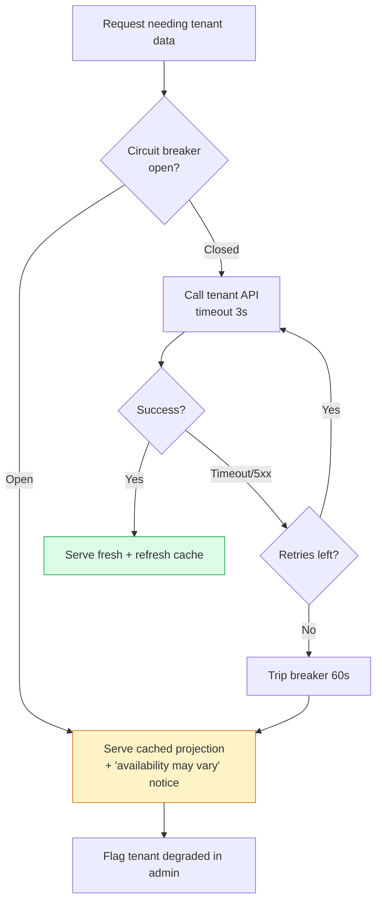

- **Browse is always available** — it reads only the local projection.
- **Checkout/booking degrades honestly** — if the tenant cannot confirm, say so and offer an enquiry, rather than taking money for something unconfirmable.
- **Per-tenant queues** so one slow tenant does not starve the others' jobs.

---

## 13. Delivery Phases

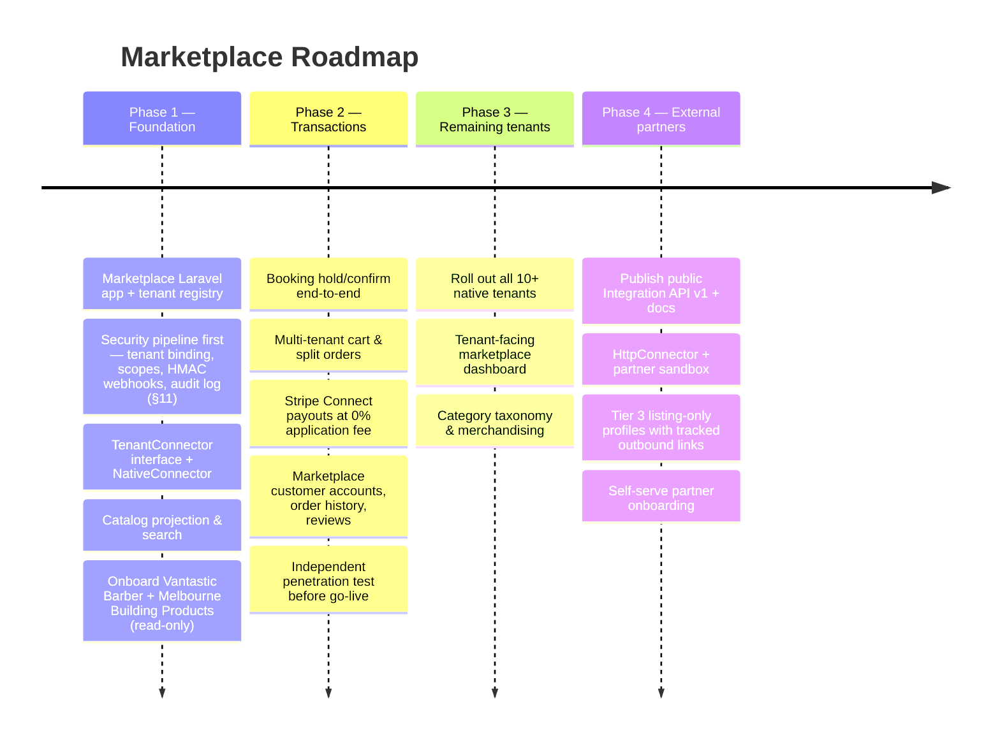

**Phase 1 exit criteria:** both pilot tenants' full catalogs are searchable in the marketplace, refresh within 5 minutes of a change, and a nightly reconciliation runs clean. No transactions yet — prove the projection before touching money. **The eight security tests in §11.11 pass in CI**, since the isolation model is far cheaper to build under the first two tenants than to retrofit under twelve.

**Phase 4 gate:** no external partner URL is called until the SSRF guard and response validator (§11.9) are in place and tested. Phase 4 is the point where the marketplace starts making requests to infrastructure we do not control.

---

## 14. Decisions

### Settled

| # | Question | Decision |
|---|---|---|
| A | Commission model — % of GMV, listing fee, or hybrid? | **None. The marketplace is free for everyone**, tenants and customers alike (§1). `commission_rate` is reserved at `0.00`. |
| B | Shared customer accounts across marketplace and tenant sites? | **No.** Separate accounts, separate credentials. Tenants keep their own customers; the marketplace has its own, and they can book or buy here (§3). SSO out of scope. |
| C | Do tenants keep their own storefronts after launch? | **Yes.** The marketplace is an additional channel, never a replacement. Price parity applies (§1). |

### Still open

These need answers before Phase 2 starts; Phase 1 can proceed without them.

| # | Question | Why it matters | Leaning |
|---|---|---|---|
| 1 | Marketplace-collected or tenant-collected payments? | Determines whether a multi-tenant cart is possible at all | Model A, Stripe Connect at 0% |
| 2 | Who bears the Stripe processing fee under Model A? | The only real cost in a free model; must be agreed in writing with pilot tenants (§9) | Tenant, deducted from payout |
| 3 | Who owns cancellation and refund policy — marketplace or tenant? | Support burden and chargeback liability, all of which now sits with us for no revenue | Tenant policy, marketplace enforces |
| 4 | Single domain (`marketplace.com.au`) or per-tenant subdomains? | SEO strategy and cookie/session design | Single domain, tenant profile pages |
| 5 | Does the marketplace own reviews, or mirror tenant reviews? | Trust signal and moderation workload | Marketplace-owned, tenant can reply |
| 6 | What funds the marketplace long-term? | Free is a positioning choice, not a cost structure — infra, support and refund handling still cost money | Absorbed as a channel-growth cost for the group's own tenants; revisit before Phase 4 opens it to external partners |

---

## 15. Assumptions Made in This Draft

1. The existing platform is multi-tenant with **isolated data per tenant** (separate DB or a `tenant_id` scope) and can expose a per-tenant internal API without significant refactoring.
2. Both pilot tenants have stable internal IDs for products/services that can serve as `external_id`.
3. The marketplace runs as a **separate deployable** sharing infrastructure (Redis, queue, object storage) but with its own database.
4. Australian market only at launch — single currency (AUD), GST applies, no multi-currency or international shipping in scope.
5. Traffic at launch is modest (thousands of sessions/day), so a single search index and a standard Laravel queue worker fleet suffice. Revisit at 10×.
6. **The web app is the only client.** There is no mobile app and none is planned in these four phases, so the marketplace API is same-origin and session-authenticated rather than a public, token-authenticated API. A mobile app later is not just a new front end — it reopens token issuance, revocation and CORS (§11.4).

*Correct any assumption that is wrong and the affected sections should be revised before Phase 1 kicks off.*
